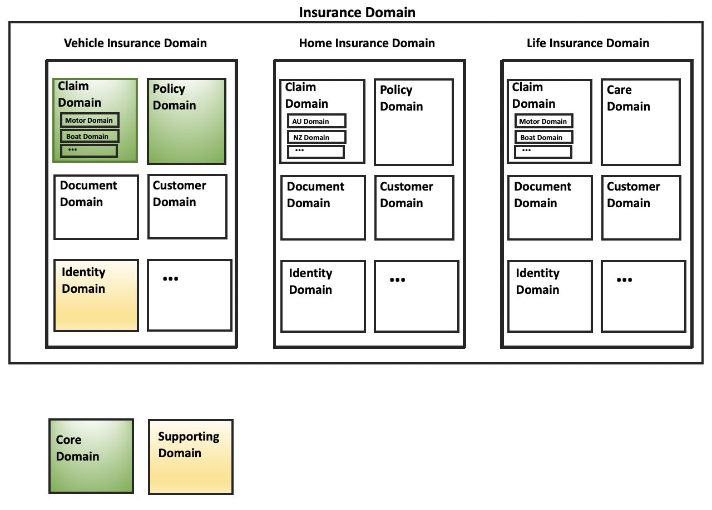
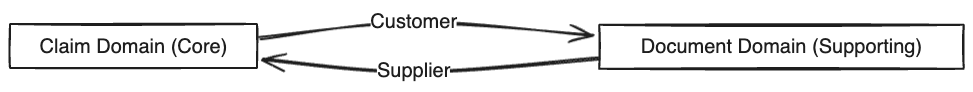
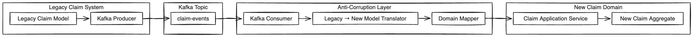
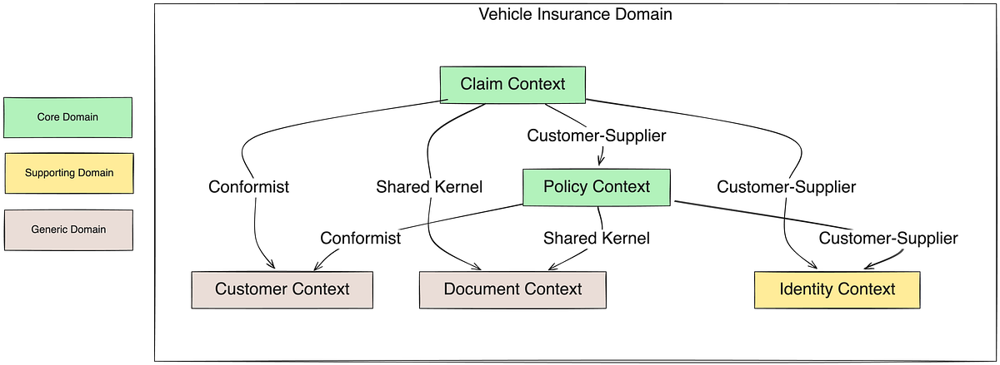

Domain Driven Design (DDD) Nedir?
===============================
DDD, hem stratejik hem de taktiksel olarak yüksek değer sunan yazılım geliştirmek ve işletmelerin rekabet güçlerini artırabilmeleri için gereklidir. Kurumların her konuda en iyisi olmaları mümkün değildir. Bunun temel nedeni, kaynakların, zamanın ve odak noktasının sınırlı olmasıdır. Bir organizasyonun her alanda mükemmel olmaya çalışması yerine hangi alanda fark yaratması ve uzmanlaşması gerektiğini (çekirdek yetkinlikler) dikkatle seçmesi stratejik bir zorunluluktur. Bu nedenle DDD, bir organizasyonun hangi alanlarda uzmanlaşması gerektiğini (çekirdek yetkinlikler) anlamasına ve kaynaklarını bu alanlarda kullanmasına yardımcı olur.
İşte tam bu noktada DDD, “her şeyi iyi yapmaya çalışmak” yerine “doğru şeyi çok iyi yapmak” fikrini merkeze alır. Organizasyonların hangi alanlarda odaklanması, nerelerde derinleşmesi ve hangi alanlara nasıl yatırım yapması gerektiğini netleştirir. Bu yaklaşımı daha somut hale getirmek için aşağıdaki başlıklara bakmak gerekir:

* **Stratejik Odaklanma ve Rekabet Avantajı:** Bir kurumun rakiplerinden ayrışmasını sağlayan şey, her işi yapması değil, Core Domain olarak belirlenen ve kuruma en yüksek stratejik değeri katan alanda mükemmelleşmesidir. Kurumlar en iyi kaynaklarını bu stratejik alanda kullanmalıdır.
* **Derin Öğrenme ve Uzmanlık Gereksinimi:** Bir alanda gerçekten başarılı olmak için ciddi şekilde derinlemesine öğrenme, iş birliği ve deney süreci gerekir. Hızlı ilerleyen bir sektörde kurumun her konuda bu seviyede bir uzmanlığa ulaşmak için yeterli zamanı ve bütçesi bulunmaz. Bu nedenle zamanbox (zaman sınırı) içinde en değerli alanlara odaklanmak zorundadır.
* **Farklı Yatırım Gereksinimleri:** İş süreçlerinin her biri aynı öneme sahip değildir. Kurumlar, core domain'lerin yanı sıra Supporting (Destekleyici) ve Generic (Genel) subdomain'lerle de ilgilenmek zorundadır. Ancak kurumun tüm alanlara eşit şekilde yatırım yapması verimsizdir. Bu yüzden stratejik olmayan alanlarda hazır çözümler kullanmak ya da daha az yatırım yapmak daha mantıklıdır.
* **Karmaşıklığın Yönetimi:** Bütün iş modellerini tek bir büyük yapı gibi yönetmeye çalışmak "Big Ball of Mud" (Büyük Çamur Yığını) adı verilen karmaşık ve yönetilemez sistemlere yol açar. Kurumlar, odaklarını bölerek, sınırları net belirlenmiş alanlarda (Bounded Contexts) çalışarak bu karmaşıklığı yönetebilirler.

Özetle her konuda iyi olmak kurumun enerjisini tüketir ve gerçek stratejik avantajını gölgeler. Bu yüzden en büyük yatırımın nereye yapılacağı konusunda bilinçli seçim yapılmalıdır.

## DDD'nin Çözdüğü Temel Problemler ve Sağladığı Faydalar

### Karmaşıklıkla Mücadele ve Etkin Tasarım
Yazılım projelerinde tasarımın "pahalı" olduğu düşüncesinden dolayı kervan yolda düzülür düşüncesinde çok fazla proje geliştirilmektedir. Tasarımı olmayan ya da kötü tasarlanmış bir yazılımın maliyeti ise başlangıçta yapılan etkili bir tasarımın maliyetinden çok daha yüksektir. Ancak tasarım kaçınılmazdır ve eninde sonunda tasarıma vakit ve kaynak ayırmak gerekecektir. DDD, karmaşık hale gelmiş projelerde çekilen acıyı azaltarak yazılımın business ihtiyaçlarını scale edilebilir bir mimariyle doğru bir şekilde modellenmesini sağlar.

### "Big Ball of Mud" (Büyük Çamur Yığını) Problemi
DDD uygulanmayan projelerde sınırları belirsiz ve birbirleriyle iç içe geçmiş birden fazla karmaşık modeller bir araya geldiğinde "Big Ball of Mud" (Büyük Çamur Yığını) oluşur. Bu durum sistemin bakım maliyetini artırır ve hatta imkansız hale getirebilir. DDD, Bounded Contexts kullanarak karmaşık modeller sınırları iyi bir şekilde çizilerek birbirinden ayırır ve kaosu engeller.

### Product ve Developer Arasındaki İletişim Kopukluğu
Yazılımcılar olarak genellikle teknolojiye aşırı odaklanarak asıl business operasyonlarını gözden kaçırabiliyoruz. Bu da işletmenin zihinsel modeli ile teslim edilen yazılım arasında büyük kopukluklara neden oluyor. DDD, Ubiquitous Language (Ortak Dil) aracılığıyla developer'lar ve domain expert'lerin aynı dili konuşmasını sağlar, yazılımın bu dili kod seviyesinde de yansıtmasını sağlayarak bu kopukluğu giderir.

### Teknik ve Mimari Problemler
DDD, yazılım ekiplerinin sıkça düştüğü tuzakları çözmeye yardımcı olur.

* **Teknoloji Odaklılık:** Problemleri iş mantığı yerine sadece yeni teknoloji trendleriyle çözmeye çalışmak.
* **Veritabanı Önceliği:** İş süreçlerini tartışmak yerine tartışmaların veritabanı şemaları üzerinden yapılması.
* **Yanlış Soyutlamalar:** Gelecekteki hayali ihtiyaçları karşılamak için feature-proofing yaparak gerçek iş ihtiyaçlarını ıskalamak.
* **Tightly Couple (Sıkı Bağlı) Servisler:** Servislerin doğrudan birbirine bağımlı olması sonucu bakım zorluklarının yaşanması.
* **Business Kurallarının Yanlış Yere Konumlandırılması:** Middleware, UI ve hatta veritabanı katmanlarına sızması.

## Stratejik Tasarım (Strategic Design)
DDD'nin en kritik aşamasıdır. Koda girmeden önce yapılan "geniş fırça darbelerine" benzetilir. Taktiksel tasarımın (aggregate'ler, domain event'ler vb.) etkili bir şekilde uygulanabilmesi için öncelikle stratejik tasarımın sağlan bir temel oluşturması gerekir.
Stratejik tasarım bir organizasyonun neyin stratejik olarak önemli olduğunu anlamasını sağlar. Önceki başlıklarda kurumların her konuda iyi olamayacağını ve kendini rakiplerden ayıracağı alanı seçmesi gerektiğinin önemini bahsetmiştim. Bu en önemli alana Core Domain denir.

### Bounded Contexts
Modellerin birbirinden ayrıldığı anlamsal sınırlardır. DDD'de merkezi bir desendir. Bu sınırlar içerisinde her bileşenin belirli bir anlamı vardır ve bu anlam o bağlama özeldir. Modellerin sınırlarını net olarak çizmek Big Ball of Mud'ı (Büyük Çamur Yığını) engeller.

**Sigorta Domain'i Örneği:**
Yukarıdaki diyagramda DDD - Stratejik Tasarım bakış açısıyla çizilmiş sigortacılık sektörüne ait Bounded Context haritasını inceleyelim:
* **En dış çerçeve: Insurance Domain:** En üst seviye yani Problem Space'dir. "Biz sigortacılık işini yapıyoruz" mesajını verir.
* **Bir alt seviye: Subdomain'ler:** Insurance Domain üç ana business'a ayrılmış: Vehicle Insurance Domain, Home Insurance Domain, Life Insurance Domain.
* **Her Subdomain'in içi: Bounded Context'ler:** Her bir sigorta türünün içinde aynı isimli ama farklı anlamlara sahip bounded context'ler var: Claim Domain, Policy Domain, Customer Domain, Document Domain, Identity Domain. İsimler aynı olmasına rağmen birbirinden farklı bounded context'lerde farklı amaçlara hizmet etmektedirler. Bunların invariantları, veri yapıları ve süreçleri birbirinden farklıdır.
* **Claim Domain'in içindeki daha küçük ayrımlar:** Özellikle Vehicle ve Life arasında Motor Domain ve Boat Domain'e odaklanırsak Claim domain kendi içinde tek tip olmadığını, bazı varyasyonların ayrı modeller gerektirdiğini görüyoruz.

Bu diyagramda yeşil ile işaretlenmiş olanların Core Domain olduğunu yani kurumun rakiplerinden ayıran, en kritik business ve en çok yatırım yapılması gereken alan olduğunu görüyoruz. Buna göre Claim ve Policy Domain kurumun core domain'leri olduğunu görüyoruz.
Sarı ile işaretlenmiş olanları da business için gerekli olduğunu ancak kurumun rakiplerine karşı rekabet avantajı yaratmadığını görüyoruz. Bu domainler kolay şekilde outsource edilebilir ya da dışarıdan hazır çözümler (generic) alınarak çözüm bulunabilir.

### Ubiquitous Language (UL) (Ortak Dil)
Belirli bir Bounded Context içerisinde hem yazılımcıların hem de domain expert'lerin konuştuğu, aynı zamanda kodun içinde de kullanılan dildir.
Bounded Context başlığında bahsettiğim örneğe geri dönecek olursak, bu örnekte tek bir ubiquitous language (UL) olmadığını göreceiz.
UL sadece ilgili Bounded Context sınırları içinde geçerlidir. Örnekte aynı kelimeler farklı UL'leri temsil etmektedir.

**Vehicle Insurance Domain - Claim UL:**
* Claim
* MotorClaim
* BoatClaim
* DamageAssessment
* RepairShop
* ..
  (Burada Claim ifadesi araç hasarını temsil etmektedir.)

**Home Insurance Domain - Claim UL:**
* Claim
* PropertyDamage
* FireIncident
* FloodRisk
* LocatiomRiskZone
* ..
  (Burada ise Claim konutla ilgili riskleri temsil etmektedir.)

### Subdomains
Karmaşık business'ları mantıksal parçalara bölünmesidir. Core Domain (stratejik rekabet alanı), Supporting Subdomain (destekleyici ama çekirdek olmayan) ve Generic Subdomain (hazır çözümlerle halledilebilen) olarak üçe ayrılır.
Yukarıdaki diyagramda Insurance Domain altında bulunan Vehicle, Home ve Life Domain'lerin her biri subdomain'dir.

**Subdomain ≠ Bounded Context**
Yukarıdaki diyagrama göre subdomain ve bounded context'lerinin ayrımı şu şekilde oluyor:
* **Subdomain:** "ne iş yapıyoruz?" sorusunun cevabıdır. (Vehicle, Home, Life)
* **Bounded Context:** "bu işi hangi dil ve modelle yapıyoruz?" sorusunun cevabıdır. (Claim, Policy, Customer)

| Subdomain Türü | Diyagramdaki Karşılığı | İşteki Rolü | Neden Bu Sınıfta? | Outsource/Hazır Çözüm Uygulanabilir mi? |
| :--- | :--- | :--- | :--- | :--- |
| **Core Domain** | Claim Domain (Vehicle/Home/Life), Policy Domain | Şirketin rekabet avantajı yarattığı alan. | En karmaşık iş kurallarına sahip. Şirketi farklılaştırır. Sürekli gelişir. | Outsource edilemez. Hazır paket uygun değil. Şirket içi senior ekip gerektirir. |
| **Supporting Subdomain** | Document Domain, Customer Domain, Care Domain | Core Domain'i çalışmasını destekler. | İş için gereklidir. Rekabette fark yarattırmaz. | Kısmen outsource edilebilir. |
| **Generic Subdomain** | Identity Domain, Implicit: Notification, Logging, Auth | Her şirkette benzer yapılar vardır. | Domain bilgisi gerektirmez. | Kullanıcı yönetimi ve auth mekanizması için Keycloak/Auth0 kullanılabilir. Müşteri iletişimleri için hazır Email/SMS servisleri kullanılabilir. |

### Context Mapping
DDD'de stratejik tasarım aşamasında farklı Bounded Context'ler arasında hem ekipler arasındaki ilişkilerinin hem de teknik entegrasyon yöntemlerininin tanımlandığı yöntemdir.
Her Bounded Context'in kendine has bir ubiquitous langauge'i vardır. Context Mapping bu diller arasında tercümeyi ve etkileşim biçimini temsil eder.
Context Mapping türleri şunlardır:

#### Ekip İlişkileri ve Stratejik Yaklaşımlar
* **Partnership:** İki ekip arasındaki hedefler birbirine bağımlıdır. Ekipler ya birlikte başarılı olur ya da birlikte başarısız olurlar. Sürekli entegrasyon ve dirsek temaslı çalıştırma gerektirir. Sigorta Domaini örneğinde; Vehicle Insurance içinde Claim ile Policy domain'leri birbirlerine partnership olarak bağlıdır. Çünkü; Claim poliçe olmadan anlamsızdır, poliçe claim kuralları olmadan eksiktir.
* **Shared Kernel:** İki veya daha fazla ekibin modelin küçük ama ortak bir parçasını paylaştığı durumdur. İki bounded context'in sadece %100 ortak, davranış içermeyen ve küçük bir model parçası varsa (Örn: Money, Currency) shared kernel olarak paylaştırılabilir.
* **Customer-Supplier (Müşteri-Tedarikçi):** Supplier'ın üst akış (Upstream-U), müşterinin ise alt akış (Downstream-D) olduğu ilişkidir. Supplier değişim önceliğine sahiptir. Sigorta örneğinde; Claim Domain -> Customer, Document Domain -> Supplier'dır. 
* 
* **Conformist (Uyumcu):** Üst akış ekibinin alt akış ekibinin ihtiyaçlarını karşılamak konusunda bir motivasyonu olmadığı durumlarda, alt akış ekibinin üst akış modelini olduğu gibi kabul ettiği durumdur. (Örn: Dışarıdan hazır alınan bir Document Management System).
* **Separate Ways (Ayrı Yollar):** Bounded Context'ler arasında entegrasyonun anlamlı bir kazanç sağlamayacağı anlaşıldığında her ekibin kendi özel çözümlerini üretmesidir.
* **Big Ball of Mud (Büyük Çamur Yığını):** Karmaşık ve sınırları belirsiz sistemlerle (legacy sistemler gibi) karşılaşıldığında, bu karmaşanın kendi modelinizi kirletmesine izin verilmemelidir.

#### Teknik Entegrasyon ve Korunma Mekanizmaları
* **Anticorruption Layer (ACL):** En savunmacı yaklaşımdır. Alt akış ekibi, dışarıdan gelen yabancı kavramların kendi modelini etkilememesi için izolasyon katmanı oluşturur. 
* **Open Host Service (OHS):** Bir Bounded Context'e erişimi kolaylaştırmak için tanımlanmış, dökümante edilmiş bir protokol veya API'dir. (REST, gRPC, Kafka vb.)
* **Published Language (PL):** OHS'nin konuştuğu resmi dildir. Servisi dış dünyaya açarken sahip olduğu kurallardır (JSON DTO'lar, event schema vb.).

| Kavram | Kimin için? | Amaç |
| :--- | :--- | :--- |
| **ACL** | Consumer'ı korur | Legacy kirliliğini engeller. Domain Model'e sızmayı önler. |
| **OHS** | Provider'ı korur | Entegrasyonu merkezileştirir. Açık bir kapı sunar. |
| **PL** | Client <-> Domain Model | İletişimde kullanılacak dili tanımlar (Sade tutulmalıdır). |

## Taktiksel Tasarım (Tactical Design)
Taktiksel Tasarım (Tactical Design), Domain-Driven Design'ın (DDD) stratejik tasarım ile atılan temel üzerine inşa edilen, alan modelinin ince ayrıntılarını boyamak için "ince bir fırça" kullanmaya benzeyen aşamasıdır. Stratejik tasarım işin geniş kapsamını ve sınırlarını belirlerken, taktiksel tasarım bu sınırların (Bounded Context) içindeki yazılım modelinin nasıl uygulanacağına ve iş operasyonlarının kod seviyesinde nasıl doğru bir şekilde yansıtılacağına odaklanır.
Taktiksel tasarımın temel araçları ve kavramları şunlardır:

1. Temel Modelleme Araçları
   Aggregates: Taktiksel tasarımın en öne çıkan araçlarından biridir. Bir veya daha fazla Entity ve Value Object'ten oluşan, bir bütün olarak ele alınan nesne grubudur. Her aggregate'in bir "Aggregate Root"u vardır ve bu kök, küme içindeki tüm tutarlılığı sağlar.
   Entities: Eşsiz bir kimliğe (identity) sahip olan, zaman içinde durumu değişebilen (mutable) bireysel nesneleri modeller.
   Value Objects (Değer Nesneleri): Eşsiz bir kimliği olmayan, sadece sahip olduğu özniteliklerle (attributes) tanımlanan ve değişmez (immutable) olan kavramsal bütünleri modeller
2. İş Kuralları ve Tutarlılık
   İş İnvariantlarını Koruma: Taktiksel tasarım, iş kurallarının (invariants) küme sınırları içinde korunmasını sağlar. Bir işlem (transaction) tamamlandığında, küme içindeki tüm parçalar iş kurallarına göre tutarlı olmalıdır.
   İşlem Sınırları (Transactional Boundaries): Kümeler, veritabanı işlemlerinin sınırlarını belirler; genel bir kural olarak, tek bir işlemde yalnızca bir küme örneği değiştirilmeli ve kaydedilmelidir.
3. Event Driven Modelleme
   Domain Events: Bir Bounded Context içinde meydana gelen, iş açısından önemli bir olayın kaydıdır. Modeli açık bir şekilde ifade etmeye ve olan biteni diğer sistemlerle veya kümelerle paylaşmaya yardımcı olur.
   Event Sourcing: Bir kümenin durumunu bütünüyle saklamak yerine, o küme üzerinde gerçekleşen tüm alan olaylarının bir akış (event stream) olarak kaydedilmesi yöntemidir.
4. Uygulama Kuralları
   Aggregate içindeki iş invariantlarını koruyun.
   Bellek ve performans avantajı için küçük aggregate'lar tasarlayın.
   Diğer aggregate'lere yalnızca kimlik (identity) üzerinden referans verin.
   Diğer aggregate'ları eventual consistency olarak güncelleyin. Tek bir transaction'da tüm aggregate'ları güncellemek yerine, event driven bazlı ilerleyip eventual consistency sağlayın.

Yukarıdaki kavramlara biraz daha detaylı bakalım:

### Aggregate Root ve Transaction Boundary
Aggregate, verilerin değişimi sırasında tek bir birim olarak ele alınan, bir veya birden fazla Entity, Value Object nesne grubudur.
Bir aggregate'in temel amacı işlem tutarlılığı (transactional consistency) sağlamaktır.
Aggregate Root: Her aggregate'in bir kök entity'i vardır. Diğer aggregate'ler yada servislerden bir aggregate içindeki herhangi bir parçaya erişmek isterlerse sadece bu aggregate root üzerinden iletişim kurarlar. Aggregate root, aggregate içindeki diğer tüm parçaların (entity, value object) sahibidir.
Örnek aggregate root tasarımı:

#### Value Object ve Entity:
    
    // Value Object: Değişmez (Immutable)
    public record Premium(BigDecimal amount, String currency) {
      public Premium {
        if (amount.compareTo(BigDecimal.ZERO) < 0)
        throw new IllegalArgumentException("Prim tutarı negatif olamaz.");
      }
    }

    // Entity: Poliçe içindeki araç. Ayrı bir aggregate olması gereken durumu aşağıda bahsettim
    @Entity
    public class InsuredVehicle {
      @Id @GeneratedValue
      private Long id;
      private String vin; // Araç Şasi No
      // ...
    }

#### Aggregate Root:
Burada en önemli nokta, dışarıdan class fieldlarına doğrudan erişimi kapatmak yani setter kullanmaktan yapmaktır. Tüm değişikler metot üzerinden ilerlemelidir ki aggregate invariantları dışarıya sızmasın.
      
      @Entity
      @Table(name = "policies")
      public class Policy {
      
          @Id
          @GeneratedValue(strategy = GenerationType.IDENTITY)
          private Long id;
      
          @Column(unique = true, nullable = false)
          private String policyNumber;
      
          private LocalDate expiryDate;
      
          // Aggregate içindeki Entity
          @OneToOne(cascade = CascadeType.ALL, orphanRemoval = true)
          private InsuredVehicle vehicle;
      
          // Aggregate içindeki Value Object listesi
          @ElementCollection
          @CollectionTable(name = "policy_coverages", joinColumns = @JoinColumn(name = "policy_id"))
          private List<Coverage> coverages = new ArrayList<>();
      
          // JPA için gerekli default constructor
          protected Policy() {}
      
          // Aggregate Root üzerinden oluşturma (Constructor)
          public Policy(String policyNumber, String vin, List<Coverage> initialCoverages) {
              if (initialCoverages == null || initialCoverages.isEmpty()) {
                  throw new DomainException("Poliçe en az bir teminat ile başlatılmalıdır.");
              }
              this.policyNumber = policyNumber;
              this.vehicle = new InsuredVehicle(vin);
              this.coverages.addAll(initialCoverages);
              this.expiryDate = LocalDate.now().plusYears(1);
          }
      
          // İş Mantığı (Invariants): Teminat ekleme kuralı
          public void addCoverage(Coverage coverage) {
              if (isExpired()) {
                  throw new DomainException("Süresi dolmuş poliçeye yeni teminat eklenemez.");
              }
              this.coverages.add(coverage);
          }
      
          public boolean isExpired() {
              return LocalDate.now().isAfter(expiryDate);
          }
      
          // Getter'lar (Sadece okunabilir erişim sağlamak için listeyi sarmalıyoruz)
          public List<Coverage> getCoverages() {
              return Collections.unmodifiableList(coverages);
          }
      }

#### Repository
Repository'i sadece Aggregate Root için oluşturmalıyız. InsuredVehicle veya Coverage için ayrı bir repository açılmamalıdır.

    @Repository
      public interface PolicyRepository extends JpaRepository<Policy, Long> {
      Optional<Policy> findByPolicyNumber(String policyNumber);
    }

Bu şekilde tanımlamalar yapıldığında aşağıdaki avantajlar elde edilir:

Encapsulation: Çok sıkı şekilde encapsulation yapılmış olur. Çünkü aggregate fieldlarına dışarıdan herhangi bir müdehale yapılamaz. Tüm müdahaleler metotlar üzerinden yapılır ve metotlar da invariantlar barındıracağından dolayı sıkı bir encapsulation sağlanmış olur.

Orphan Removal: Poliçe silindiğinde ona bağlı araç ve teminatlar da veritabanından otomatik silinir. Çünkü onlar bu aggregate'in bir parçasıdır.
Ubiquitous Language: Kodda setExpiryDate gibi teknik terimler yerine isExpired gibi business diline yakın ifadeler kullandık.

InsuredVehicle ne zaman ayrı bir Aggregate olmalıydı?
Eğer sisteminiz sadece sigorta satışı değil, aynı zamanda bir Filo Yönetimi veya Hasar Takip Sistemi gibi business'lar içeriyorsa InsuredVehicle ayrı bir Aggregate Root olarak konumlandırılması gerekirdi.

Bağımsız Yaşam Döngüsü: Araç, poliçeden bağımsız olarak kaydedilecek, servis bakımları takip ediliyor ve üzerinde poliçeden bağımsız işler yapılabilecek.

Referansla Bağlantı: Bu durumda Policy içinde InsuredVehicle nesnesini direkt tutmak yerine sadece o aracın ID değerini tutmalıyız.
    
    public class Policy {
      private Long vehicleId; // Başka bir Aggregate'e ID ile referans
      // ...
    }

Durum | Entity (Poliçe İçinde) | Aggregate Root (Ayrı)
--- | --- | ---
Bağımsız Erişim | Hayır, sadece Poliçe üzerinden erişilir. | Evet, vehicleRepository.find() ile çağrılır.
Silinme Senaryosu | Poliçe silinince araç bilgisi de gider. | Poliçe silinse de araç sistemde kalır.
Eşzamanlılık | Poliçeyi güncelleyen aracı da günceller. | Araç ve Poliçe aynı anda farklı kişilerce güncellenebilir.

### Anemic Domain Modeller'den Rich Domain Modellere Geçiş
Taktiksel tasarımın ne kritik ayrım noktasına geldik. Bu iki kavram, kodun sadece "veri taşıyıcısı" mı yoksa "yaşayan bir organizma" mı arasındaki farkı belirler.

#### Anemic Domain Model
Bu modelde nesneler sadece veriyi tutan yapılardır. İçlerinde herhangi bir business logic barındırmazlar. Sadece getter/setter metotları vardır.

Business logic nerededir? Genellikle Service katmanındaki devasa metodların içinde yer almaktadır.

Yapısı: Genelde sadece private alanlar ve onlara erişen metodlardan ibarettir.

Sorun Nedir? Nesne, iş kurallarını koruyamaz. Herhangi bir servis, bir poliçenin bitiş tarihini rastgele bir geçmiş tarihe setleyebilir ve nesne buna "dur" diyemez.
    
    // Nesne sadece veri taşır
    public class Policy {
      private BigDecimal price;
      public void setPrice(BigDecimal price) { this.price = price; }
      public BigDecimal getPrice() { return price; }
    }
    
    // Mantık servisin içinde boğulur
    public class PolicyService {
      public void applyDiscount(Policy policy, BigDecimal discount) {
        BigDecimal newPrice = policy.getPrice().subtract(discount);
        if (newPrice.compareTo(BigDecimal.ZERO) < 0) throw new Exception(); // Kural burada
        policy.setPrice(newPrice);
      }
    }

### Rich Domain Model (DDD'nin Tercihi)
DDD'nin savunduğu model budur. Burada nesle, hem veriye hem de o veri üzerinde işlem yapan business logic'lere sahiptir.

Business logic nerededir? Bizzat nesnenin (Entity veya Value Object) içindedir.

Yapısı: setter metotları ya hiç yoktur ya da private'dır. Veri değişiklleri sadece metodlar (örn: cancelPolicy(), applyDiscount()) aracılığıyla yapılır.

Avantajı: Nesne invariantları kendisi sağlar. Kod, iş birimlerinin (product-developer-tester ve diğerleri) konuştuğu dile (Ubiquitous Language) çok daha yakındır.
   
    public class Policy {
      
      private BigDecimal price;

      // Kural nesnenin içinde, kapsüllenmiş durumda
      public void applyDiscount(BigDecimal discountAmount) {
          if (discountAmount.compareTo(this.price) > 0) {
              throw new DomainException("İndirim tutarı fiyattan büyük olamaz.");
          }
          this.price = this.price.subtract(discountAmount);
      }
    }

Özellik | Anemic Model | Rich Domain Model
--- | --- | ---
Mantık (Logic) | Service katmanında toplanır. | Entity ve Value Object içindedir.
Encapsulation | Zayıftır, herkes her veriyi değiştirebilir. | Güçlüdür, verilere erişim kontrollüdür.
Bakım Edilebilirlik | Zor; mantık servisler arasında dağılır. | Kolay; kuralın yeri bellidir.
Nesne Yönelimli | Aslında prosedürel bir yaklaşımdır. | Gerçek nesne yönelimli (OOP) yaklaşımdır.

#### Repository Kavramı

DDD'de Repository kullanımı, verinin "nasıl" saklandığını business mantığından (domain) tamamen koparmayı amaçlar.
Domain katmanı verinin neye benzediğini ve kurallarını bilir ancak, Infrastructure katmanı bu veriyi diske nasıl yazılacağını bilir.
Repository, bu iki katman arasındaki sözleşmedir (interface).

Bir örnekle bu konuya biraz daha detaylı bakalım:

##### 1. Domain Katmanı (Interface)

Bu katmanda herhangi bir framework (JPA vb.) bağımlılık bulunmaz. Projenin geliştirildiği saf dil ve iş kuralları interfaceleri vardır.

      // domain/repository/PolicyRepository.java
      public interface PolicyRepository {
      Optional<Policy> findById(Long id);
      void save(Policy customer);
      void delete(Long id);
      }

##### 2. Infrastructure Katmanı (Implementation)

Bu katmanda framework (JPA vb.) bağımlıkları kullanılabilir. İş kuralları için daha önceden tanımlanan interface burada başka bir interface'e extend edilir ve veritabanı ile konuşacak alt yapı bu katmanda kurulur.

// infrastructure/persistence/JpaPolicyRepository.java
@Repository
public interface JpaPolicyRepository extends JpaRepository<Policy, Long> {
// Spring Data JPA'nın gücünü burada kullanıyoruz
}

##### Adapter

      // infrastructure/persistence/PolicyRepositoryImpl.java
      @Component
      @RequiredArgsConstructor
      public class PolicyRepositoryImpl implements PolicyRepository {

          private final JpaPolicyRepository jpaRepository;
      
          // Override methods, persistence business.
      }

##### Neden Bu Kadar Zahmete Girdik?

Domain katmanında repository için interface tanımları yaparak bir esneklik kazanmış olduk.
Bu esnekliği Infrastructure katmanındaki implementasyonları değiştirdiğimizde ediniriz.
Yani yarın bir gün PostgreSQL'den MongoDB'e geçmeye karar verirsek Infrastructure katmanındaki implementasyon değiştirilir ve Domain ve Application katmanlarını bu değişimden hiç etkilenmez.

### Domain Events

Domain içinde gerçekleşen ve business'ın önem taşıdığı bir olayı temsil eder.

Örneğin:
Poliçe Oluşturuldu (PolicyIssued)
Poliçe Silindi (PolicyDeleted)

DDD'nin en zorlu konularından birisi Aggregate'lar arası iletişimdir.
Kural der ki: "Bir transaction içinde yalnızca bir Aggregate güncellenmelidir."

Peki Poliçe oluşturulduğunda bir Billing oluşturulması gerekiyorsa ne yapacağız?

1. Poliçe Aggregate'i işini yapar ve PolicyIssued eventi fırlatılır.
2. Billing Aggregate'i bu eventi dinler ve kendi transaction'ı içinde stoğu günceller.

Bu yaklaşıma Eventual Consistency denir.

Peki Eventual Consistency yöntemine neden ihtiyaç duyuyoruz?

1. Business Invariantlarını Korumak:
   Bir Aggregate, iş kurallarının (invariant) her zaman geçerli olduğu en küçük tutarlılık sınırıdır.
   Eğer bir transaction'da birden fazla Aggregate üzerinde işlem yapılırsa Aggregate'lerin sınırları bulanıklaşır.

Örnek senaryo:
Bir Policy oluşturulurken aynı zamanda Billing oluşturulursa ve Billing Aggregate'in invariantları karmaşıksa bu invariantlar Policy transaction'ını şişirir.

2. Scaling ve Locking Sorunları:
   Eğer hem Policy hem de Billing Aggregate'leri aynı anda kilitleniyorsa sistemdeki concurrency düşer.
   Sistemdeki kullanıcı sayısı arttığında devasa transaction'lar birbirini bekler hale gelir ve deadlock riski artar.
   Tek Aggregate kuralı bu durumları minimumda tutar.

3. Distributed Sistemlere Hazırlık:
   Geçerli bir DDD uygulamasında, her Aggregate teorik olarak farklı bir mikro serviste veya farklı veritabanı sunucusunda yaşayabilir.
   Eğer tek transaction'da birden fazla Aggregate işliyorsanız bunları koparmak zor hale gelecektir.

Eventual Consistency'nin uygulandığı yerlerde fallback durumlarını yönetebilmek için Saga gibi çözümler kullanmak gerekebilir.

Saga'ı Choreography yerine Orchestration olarak kullanmak büyük resimdeki karmaşıklığı azaltacaktır.
Ayrıca eventler işlenirken exception meydana gelmesi durumlarında retry mekanizmalarının kurulması elzemdir.

Örnek Kod:

1. Domain Event: Poliçenin kesildiğini temsil eden event.

      // domain/event/PolicyIssuedEvent.java
      public record PolicyIssuedEvent(
         Long policyId,
         Long customerId,
         BigDecimal premiumAmount,
         LocalDateTime issuedAt
      ) {}

2. Publisher:

   
   
       // domain/service/PolicyService.java
       @Service
       @RequiredArgsConstructor
       public class PolicyService {
        
          private final PolicyRepository policyRepository;
          private final ApplicationEventPublisher eventPublisher;
   
   
          @Transactional
          public void issuePolicy(PolicyRequest request) {
              Policy policy = new Policy(request.customerId(), request.amount());
              policyRepository.save(policy);
      
              eventPublisher.publishEvent(new PolicyIssuedEvent(
                  policy.getId(),
                  policy.getCustomerId(),
                  policy.getPremiumAmount(),
                  LocalDateTime.now()
              ));
      
              System.out.println("Poliçe başarıyla oluşturuldu: " + policy.getId());
          }
   }

3. Billing Modülü (Subscriber / Listener)

    
      // infrastructure/listener/BillingEventListener.java
       @Component
       public class BillingEventListener {

          @TransactionalEventListener(phase = TransactionPhase.AFTER_COMMIT)
          public void handlePolicyIssued(PolicyIssuedEvent event) {
              System.out.println("Poliçe yayını yakalandı. Fatura oluşturuluyor...");
          }
    }

Kaynaklar:
* DDD Distilled Vaughn Vernon
* https://alok-mishra.com/2020/08/17/ddd-domains-bounded-contexts/
* https://www.martinfowler.com/bliki/BoundedContext.html